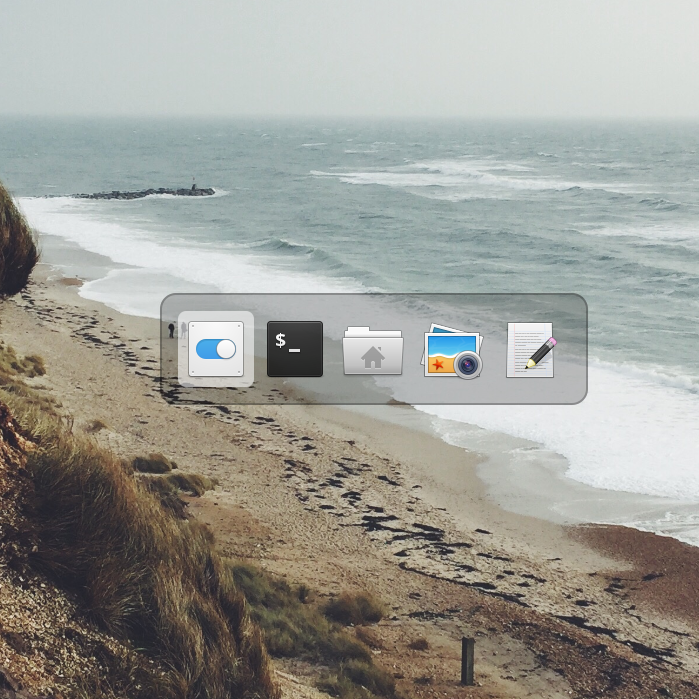

# Gala Window Switcher For elementaryOS

This is an alternative to the stock libplank window switcher.
This is a fork of "Gala Window Manager Alternative Window Switcher" project:
<br>https://github.com/tom95/gala-alternate-alt-tab

<p align='center'>

</p>

## Install

build from sources:
```bash
$ mkdir build
$ cd build
$ cmake -DCMAKE_INSTALL_PREFIX=/usr ..
$ make
$ sudo make install
```
or via ppa:
```bash
$ sudo add-apt-repository ppa:popye/eos-window-switcher
$ sudo apt-get update
$ sudo apt-get install gala-eos-window-switcher
```

After installing you need re-login or replace gala instance with command:
```bash
$ gala --replace
```
Switcher's settings location:
```bash
/org/pantheon/desktop/gala/plugins/elementary-alt-tab/
```
<p align='center'>
    
</p>

## Known issues

1. Switcher do no close correctly for backwar switching (alt+shift+tab), if you using
alt+shift for keyboard layout switching. Use another hot-key (ctrl+shift for example).
